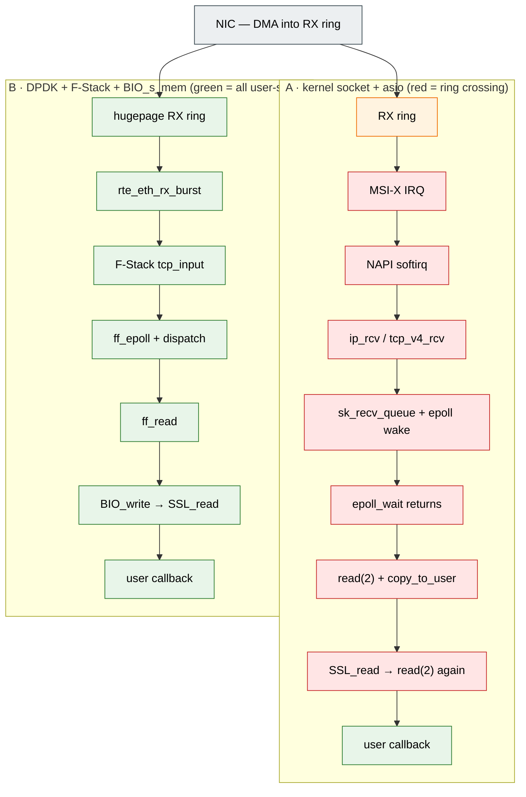
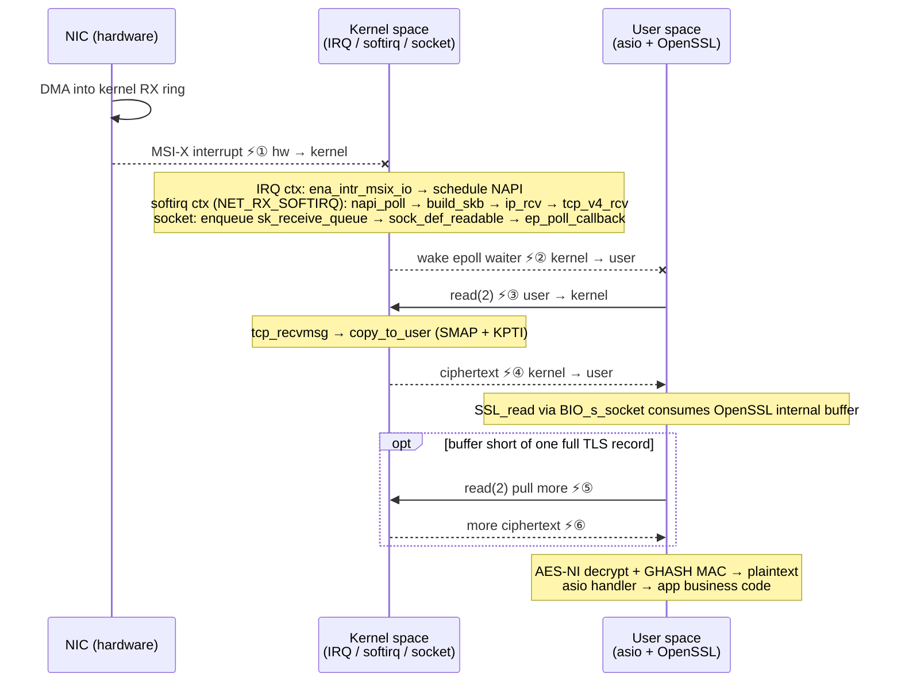
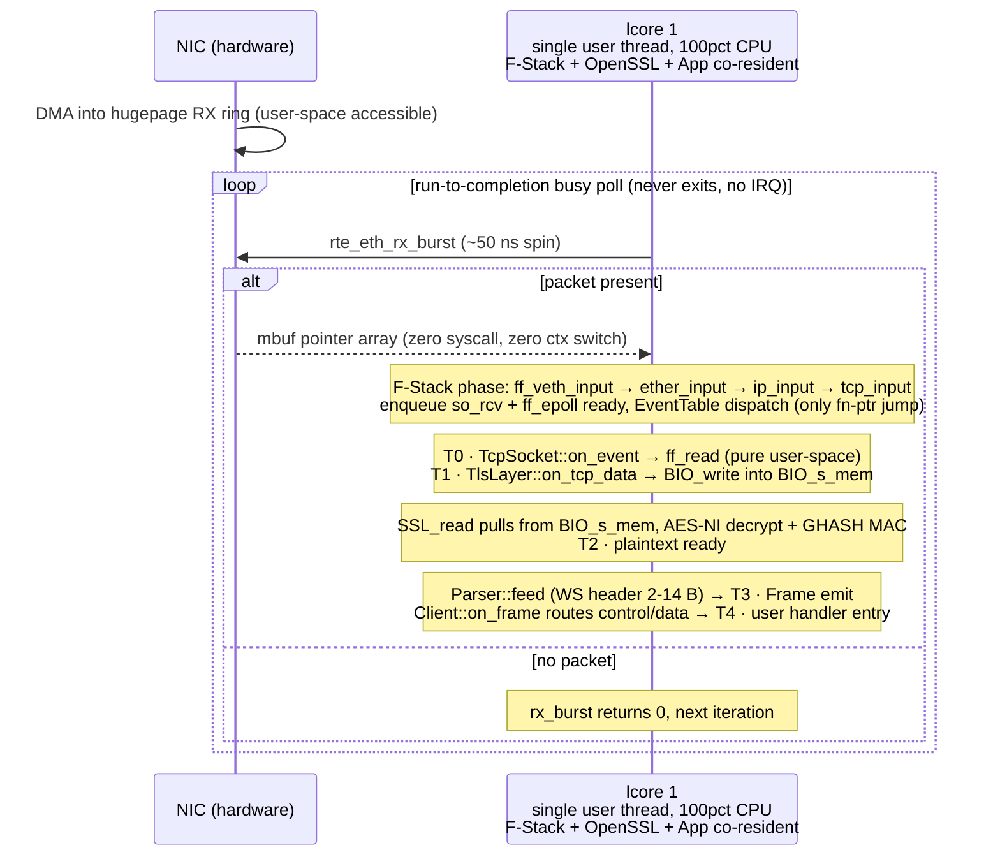
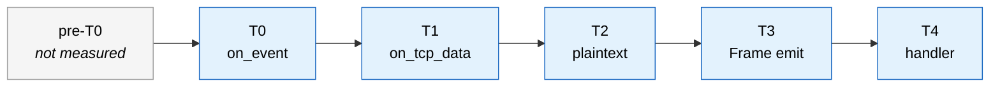

+++
title = 'DPDK vs 传统 kernel socket：网络收包机制的原理、源码路径与纳秒级实测拆解'
date = 2026-04-24T00:00:00+08:00
draft = false
tags = ["Network", "HFT", "Performance"]
+++

*— 为什么一条路径的 p50 是 5 µs，另一条是 20 µs？差的不是"优化"，是**架构约束的方向**。*

---

> **本文作用**：把两条路径在**原理层**和**机制层**的差异讲到底，而不是停在 "DPDK 更快" 这种总结句。
>
> **读者**：C++ 后端 / 网络工程师；熟悉 socket 与 epoll，对内核栈和 DPDK 只了解到 "听说过" 的程度。
>
> **关于 asio**：asio / libuv / Netty / golang net 都是同一条 **kernel socket + epoll + read(2)** 路径的 API 封装，本文用 asio 作为这条路径的代表。
>
> **实测数据来源**：作者实现的一套 **DPDK 23.11 + F-Stack v1.24 + OpenSSL 3 (BIO_s_mem)** 架构的 HFT 级 WebSocket 客户端，单连接订阅 Binance bookTicker，~180 B/帧，运行在 AWS EC2 2 vCPU VM（Debian 12，kernel 6.1）。60 秒样本 n = 26 835。

---

## 0. TL;DR（一分钟先读这个）

**3 个根本差异**

1. **触发机制**：kernel socket 被**中断推动**（NIC IRQ → softirq → 唤醒进程）；DPDK 由用户代码**主动轮询**（lcore 在 `rte_eth_rx_burst` 里转）。
2. **协议栈位置**：kernel socket 的 TCP/IP 在 ring 0 内核代码里跑；DPDK + F-Stack 把 FreeBSD 的 TCP 栈搬到**用户进程内**，作为普通函数调用。
3. **用户 ↔ 网络数据接口**：kernel 路径靠 `read(2)` 把 skb 里的字节 `copy_to_user`；DPDK 路径直接访问 hugepage 里的 mbuf，OpenSSL 用 `BIO_s_mem` 手动喂字节，**0 syscall**。

**DPDK + F-Stack + BIO_s_mem 相对 kernel socket 的 5 个优点**

| # | 优点 | 原理 | 消掉的 kernel 开销 |
|---|------|------|------|
| 1 | **0 syscall / 帧** | `BIO_s_mem` 接管 TLS 喂字节，OpenSSL 不走 `read(2)` | 典型 1-2 次 `read(2)` / 帧，TLS record 跨 TCP segment 时最坏 12 次，每次 200-500 ns + KPTI 切页表 |
| 2 | **0 IRQ / 帧** | lcore busy-poll 代替硬件中断 | IRQ + softirq 调度 1-5 µs + 不可控抖动 |
| 3 | **0 skb 动态分配 / 帧** | mempool 预分配 mbuf，生命周期只是 "取出 → 归还" | 每包 skb 头 slab 分配 100-200 ns + slab 锁竞争 |
| 4 | **0 次 copy_to_user** | 数据从 DMA 到 handler 全程在 user ring 3 可访问的 hugepage 上 | SMAP/KPTI 跨边界拷贝税 100-500 ns/次 |
| 5 | **0 上下文切换 / 帧** | F-Stack 让协议栈与应用同线程，模板组合把整条链编译期折成单函数 | IRQ→softirq→user 切换 ~1 µs + L1/L2 cache 被内核填脏 |

**代价**（必须认清）

- 1 个 CPU 核永久 100% 占用（busy-poll 的代价）
- 部署门槛：hugepage 预留、`igb_uio` / `vfio-pci` 抢网卡、F-Stack 配置；要吃满收益还得配 `isolcpus` + `nohz_full`
- 丢掉 kernel socket 的通用性：该网卡无法再被其他进程共享，也无法 `ss -tnp` 观察、iptables 过滤

**实测对比**（本文案例，AWS EC2 VM，60 s，n = 26 835）

| 指标 | kernel socket + asio（估算） | DPDK + F-Stack（本案例实测） |
|---|---|---|
| e2e min | ~8-15 µs | **1.1 µs** |
| e2e p50 | ~15-25 µs | **5.3 µs** |
| e2e p99.9 | ~100-300 µs | 39.9 µs * |

\* VM 限制；裸金属预期 5-10 µs。min 和 p50 已落在 DPDK 架构下限，细节见 §6。kernel socket 栏是基于公开 benchmark 的估算，非本文实测。

**下文组织**：**§1 原理层**（为什么两条路径根本不同）→ **§2 图示对照**（空间 + 时序视图）→ **§3 / §4 机制层**（两条路径逐步展开）→ **§5 汇总表** → **§6 实测走查** → **§7 结论与适用场景**。

---

## 1. 原理：为什么两条路径根本不同

两条路径的差异不是 "API 选型不同" 或 "优化力度不同"，是**底层的 3 个架构约束方向相反**。先理解这 3 个约束，后面所有具体机制（为什么有中断、为什么要 `copy_to_user`、为什么 DPDK 必须独占核心）都能推出来。

### 1.1 Kernel socket 是 "在 3 个硬约束下跑通" 的方案

传统 Linux socket 被以下 3 条硬约束定义：

**约束 A：NIC 是 kernel 拥有的硬件**

PCIe 网卡的 BAR 寄存器、RX ring、MSI-X 中断向量，在启动时被 kernel 驱动（`ena` / `ixgbe` / `mlx5` 等）接管。用户程序没有访问这些硬件寄存器的权限（ring 3 无法发 MMIO）。**所以数据要进入用户态，必须让内核把它搬过来**——这是 "为什么要 syscall" 的根本原因。

**约束 B：TCP/IP 状态机共享给所有进程**

同一台机器上 N 个进程都用 socket，TCP 连接表、重传、拥塞窗口必须是统一、可审计、可 `ss -tnp` 观察的——所以它在 kernel 里，作为 `net/ipv4/tcp_*.c` 运行。这意味着**数据经过协议栈处理 ≠ 数据到达用户进程**；协议栈跑完之后，字节还在 kernel 内存里，必须再一次 hand-off。

**约束 C：ring 3 和 ring 0 之间是 CPU 硬件保护边界**

用户进程不能直接读 kernel 内存（page table supervisor 位阻止）；kernel 给用户态数据必须经过显式 `copy_to_user`（运行时切 SMAP 位，syscall 进出还要跨 KPTI 切页表）。这不是 Linux 的设计选择，是 x86-64 / ARMv8 从 ring 特权架构就定好的。

**→ 3 个约束叠加，kernel socket 的所有 "贵" 都是必然结果**：

- **NIC 必须发中断**（因为 kernel 要管硬件，且用户进程不在、不能预期何时来数据）
- **协议处理必须在 kernel 里完成**（因为 TCP 状态机是共享资源）
- **数据必须跨 ring 交付**（`read(2)` + `copy_to_user`）
- **每个 skb 必须动态分配**（因为 kernel 不知道你要多大、要处理所有协议所有 socket，只能从 slab 按需给）
- **`epoll_wait` 必须阻塞/唤醒**（因为用户进程是被中断通知的一方，不是主动拉）

这套机制在 "通用 + 共享" 维度上是非常成熟的方案，但每条约束都给单次收包加几百 ns 到几 µs。

### 1.2 DPDK + F-Stack + BIO_s_mem 是 "逐个撕掉约束" 的方案

DPDK 系的基本工程手法：**把 3 个约束一个一个解除**。每撕掉一条约束，对应的机制开销就消失。

**反向选择 A：把 NIC 从 kernel 手里抢过来**

用 `igb_uio` 或 `vfio-pci` 把网卡从 kernel 驱动 unbind，重新绑到一个 stub 驱动，stub 把 BAR 空间 mmap 进用户进程。用户代码从此能直接读 RX descriptor ring、写 TX descriptor ring，甚至直接收割 MSI-X 向量（当然 DPDK 选择不用中断，改成轮询）。NIC 不再是 "kernel 的"，它变成**这个用户进程的外设**。

→ 消掉了约束 A：用户代码可以直接看硬件，不需要中断通知。

→ 代价：这张卡被独占，其他进程和 kernel 都没法用。

**反向选择 B：把 TCP 栈搬进用户进程**

kernel 的 TCP 不能搬（它是共享的）；但 **FreeBSD 的 TCP 源码可以被移植成库**（F-Stack）——它是完整的 FreeBSD TCP 状态机 + sysctl + `so_rcv` socket buffer，编译成一个 C 静态库链进应用。从此 `tcp_input` 是一个普通 C 函数，和用户自己的 `parser::feed` 在同一个调用栈上跑。（另一类方案如 Seastar / mTCP / onload 走的是 "不搬 kernel TCP，而是重写一套 user-space TCP"，本质仍是把协议栈移出 kernel，路径不同但消掉的约束相同。）

→ 消掉了约束 B 对 "共享协议栈" 的依赖：我们不共享了，这张卡 + 这个进程独占一套 TCP 栈。

→ 代价：丢失 kernel socket 的 "多进程共享 / `ss -tnp` 观察 / iptables 过滤" 能力。

**反向选择 C：让加密层绕开 socket 接口**

OpenSSL 默认的 `BIO_s_socket` 会调 `read(2)` 从 socket fd 拿密文——但我们根本没有 kernel socket（F-Stack 的 socket 是它自己的 `ff_socket`，不是 Linux fd）。改用 `BIO_s_mem`：我们用 `BIO_write(rbio, encrypted_bytes, n)` 把 F-Stack 吐出来的密文**手动塞进 OpenSSL 的内存 BIO**，`SSL_read` 从这块内存 BIO 拿字节，OpenSSL 从头到尾没发过一次 syscall。

→ 消掉了约束 C 在 TLS 层的残余：即使有用户态 TCP 栈，如果 OpenSSL 还在 `read(2)`，也无法真正零 syscall。BIO_s_mem 是这条路径的最后一块拼图。

→ 代价：TLS 收字节变成手动操作（但这只是几行 pump 代码）。

**→ 3 个反向选择叠加，DPDK 路径的所有 "快" 都是必然结果**：

- **用户轮询**（约束 A 解除：用户代码直接看硬件）
- **mbuf 预分配**（协议栈是我们自己的，缓冲需求在启动时就知道）
- **同线程调用**（协议栈 = 库，直接函数调用，零上下文切换）
- **0 syscall**（socket 不在 kernel 里，加密层也不经过 socket fd）
- **0 copy_to_user**（数据从 DMA 到 handler 全程在 user ring 3 可访问）

### 1.3 一句话

> **kernel socket = 在 "CPU 特权架构 + 多进程共享" 约束下做到最好的默认方案**，
> **DPDK + F-Stack + BIO_s_mem = 放弃共享、独占硬件 + 独占核心换来的架构天花板**。

**谁优谁劣不是抽象问题**——是看具体场景里 "愿不愿意用 '一个 CPU 核 + 独占网卡' 换 '10× 量级的延迟下限'"。§7 给出完整的适用场景判断。

> **延伸阅读**：约束 A（NIC 是 kernel 拥有的硬件）在实际生产里的表现，可以参考 （网卡中断与多队列架构拆解）和 （核心隔离与 IRQ 亲和性）。

下面 §2 把两条路径的具体步骤并排画出来，§3 / §4 逐步展开。

---

## 2. 两条路径并排：空间视图 + 时序视图

### 2.1 空间视图（flowchart）



> 每个盒子里的完整函数名 / 工作内容见 §3.1 和 §4.1 的详表。这里只给鸟瞰。

上面的 flowchart 是**空间视图**（每步发生在哪一层）。下面两张 sequence diagram 是**时序视图**（每步由谁做、什么时候做、在不在同一执行上下文里）——读者可以把这两种视图叠在一起理解。

### 2.2 时序视图：kernel + asio 路径（3 个参与方，6 次跨边界）



**读这张图的要点**：

- 三条泳道 = 三种**硬件保护环**（NIC 硬件、kernel ring 0、user ring 3），每条 `⚡` 标记就是一次 ring 切换，代价分为直接代价（几百 ns 的陷入/返回 + 寄存器保存 + SMAP/KPTI 页表切换）和间接代价（L1/L2 cache 被内核代码填脏）。
- 内核里的三段 `Note`（IRQ / softirq / socket）虽然都在 ring 0，**但是不同执行上下文**，彼此之间有排队和调度——比如 softirq 可能被别的 softirq 串行化、socket 唤醒可能等到下一次进程调度才生效。所以这张图的"竖向距离"不是匀速的。
- `opt` 框里的 ⑤⑥ 会在 TLS record 跨 TCP segment 时反复出现（最坏 12 次，见 §3.2 (a)）。

### 2.3 时序视图：DPDK + F-Stack + BIO_s_mem 路径（1 个参与方，0 次跨边界）



**读这张图的要点**：

- **只有一条泳道**——从 `rx_burst` 到用户 handler 之间没有任何跨 ring 切换，没有 syscall，没有进程调度。整条竖线就是 lcore 1 在同一个 CPU 核上顺序推进。
- 代价前置到**进入 loop 之前的 setup**（hugepage 预分配、PMD 绑核、igb_uio 抢网卡），以及 **lcore 1 常年 100 % CPU**。这是架构换来的：把所有 "每包的不确定" 换成了 "每核的固定占用"。
- T0–T4 五个打点是案例代码里埋的测量点，不是架构本身的转折点——架构层面这条线是**连续的函数调用链**，几乎没有"交接"。
- NIC→L 之间画成 `-->>`（弱交互）是因为它是**用户代码主动去轮询**，不是硬件推送；真实语义是 L 读 RX descriptor ring 的 "own bit" 并直接接管 mbuf，跟 §2.2 里 NIC `--x` K（被动中断）形成鲜明对比。

### 2.4 两张图一起看

| 维度 | kernel + asio (§2.2) | DPDK + F-Stack (§2.3) |
|------|----|----|
| 参与方（sequence diagram 泳道数）| 3（硬件 / kernel / user）| 2（硬件 / user），且 kernel 完全缺席 |
| 跨边界次数 / 帧 | 6（含 `opt` 时最多 12+）| 0 |
| 触发机制 | 中断被动推 | 用户主动拉 |
| 上下文切换 | IRQ→softirq→user，每次含调度 | 无 |
| "谁在等" 的人 | asio 线程在 `epoll_wait` 阻塞，等内核唤醒 | 没有人在等——lcore 1 永远在跑 |
| 代价形态 | 每包不确定延迟 | 每核固定 100 % CPU |

**一句话**：§2.2 是 "多个人接力赛，每次交棒都可能掉棒"；§2.3 是 "一个人从头跑到尾，代价是这个人不能再做别的事"。下面两节把每条路径的每一步具体展开。

---

## 3. Kernel socket 路径详解

asio 本质是对 `epoll + read/write + OpenSSL BIO_s_socket` 的一层 Proactor 风格封装。它不增加额外的内核路径，也不绕开任何一步。所以讨论 "asio 怎么收包" 等价于讨论 "**Linux kernel socket + OpenSSL 收加密数据包**的机制"。

### 3.1 数据路径（正向 9 步）

| # | 发生在哪一层 | 事件 | 产生的开销 |
|---|------------|------|----------|
| 1 | NIC | 帧到达物理层，写 RX ring（内核在启动时给 NIC 预注册的 DMA buffer）| DMA，无 CPU 开销 |
| 2 | NIC → CPU | NIC raise MSI-X 中断。ENA 默认启用 DIM（动态中断节流），为吞吐节流可能把 IRQ 拉到 ~20µs 间隔一次 | 中断延迟 1-5 µs；DIM 节流时更高 |
| 3 | CPU ISR | `ena_intr_msix_io` → 调度 NAPI poll | 上下文切换 + 寄存器保存，~1 µs |
| 4 | softirq | `NET_RX_SOFTIRQ` 运行 NAPI poll。每包从 RX ring 取描述符：data 部分是驱动在 page pool 里预分配的 DMA buffer（**不是每包现分**），`build_skb` / `napi_build_skb` 在这块 data 外面从 slab 套一个 `sk_buff` 头（~256 B 控制结构）| skb 头分配 ~100-200 ns/包；softirq 调度受其他 softirq 串行化 |
| 5 | L2/L3 | `__netif_receive_skb_core` → `ip_rcv` → `tcp_v4_rcv` → `tcp_v4_do_rcv`。协议解复用、TCP 状态机、segment 合并（LRO/GRO，若开） | 1-3 µs 纯 CPU 工作 |
| 6 | socket 层 | `tcp_rcv_established` 把 skb 挂到 `sk->sk_receive_queue`。`sock_def_readable` 通知所有等这个 socket 的 waiter | skb 入队 ~100 ns；唤醒路径 500 ns - 1 µs |
| 7 | epoll | epoll fd 通过 `ep_poll_callback` 被唤醒；如果有 `epoll_wait` 阻塞在这，schedule 被唤醒，task 放回 runqueue | 500 ns - 1 µs；如果 CPU 被抢占更多 |
| 8 | 用户线程 | `epoll_wait` 返回 ready fd 列表；用户调 `read(2)` 或 `recvmsg(2)`。syscall 进入 → `tcp_recvmsg` → `skb_copy_datagram_iter` → `copy_to_user` 把 skb payload 复制到用户 buffer | syscall 往返 200-500 ns；`copy_to_user` 约 6-10 GB/s，180B payload ~20 ns |
| 9 | 用户态 | asio 的 `async_read_some` handler 跑；若是 TLS，进 `boost::asio::ssl::stream`，它调 `SSL_read`，OpenSSL 的 `BIO_s_socket` 又一次调 `read(2)` 拿加密字节（这是**第二次** syscall）| 又一次 syscall + OpenSSL 内部状态机 |

**全链路典型耗时（VM，单连接，小帧）**：p50 15-25 µs，p99.9 100-300 µs。

> 这一行是基于公开 kernel socket 基准的量级估计，**不是本文案例的实测**（案例没有 asio 分支）。作为 §5 汇总表的锚点使用，请勿当成严格 benchmark。

### 3.2 两个容易被忽略的开销源

**(a) BIO_s_socket 的双重 syscall**：OpenSSL 的 `SSL_read` 对已解析出的 TLS record 有内部缓冲，不是每次调用都触发 syscall；但**内部缓冲耗尽、需要补加密字节时**，`BIO_s_socket` 会调 `read(2)` 从 socket 拉数据。更糟的情况是 **TLS record 跨 TCP segment**：一个 16 KB record 在 MSS=1448 的链路上最坏要 12 次 `read(2)` 才能凑齐，中间任何一次被别的 softirq / 抢占打断都会堆到延迟里。BIO_s_mem 的意义就是把这个 "补字节" 路径换成纯用户态的 `BIO_write`，彻底消掉 syscall。

**(b) 缓存失效**：IRQ / softirq / syscall 每穿越一次特权边界，CPU 的 L1/L2 cache 会被内核代码路径填充，用户态代码的热数据被挤出去。两条路径交替使用核心，cache miss 率远高于纯用户态环境。这在 microbench 里看不出来，跑真实业务时是**抖动的隐形来源**。

### 3.3 抖动（jitter）来源（决定 p99 / p99.9 的东西）

| 抖动源 | 发生条件 | 量级 |
|--------|---------|------|
| 其他 IRQ / softirq 串行化 | 同 CPU 上其他 softirq（timer、block、NET_TX）占用 | 10-100 µs |
| NAPI poll budget 耗尽 | 高速率下 NAPI 一次 poll 最多 64 包，超出延后到下轮 | 10-50 µs |
| GRO 聚合等待 | LRO/GRO 可能延迟 flush | 10-100 µs |
| 进程抢占 | RT 进程 / 其他 runnable task 抢占读者线程 | 几百 µs |
| `copy_to_user` 缺页 / KPTI | Meltdown 缓解下 syscall 边界更贵 | 100-500 ns 额外 |
| NUMA 错位 | skb 在 NIC 所在 node 分配，读者线程在另一 node | 100 ns - 几 µs |

asio 本身不贡献抖动，但它也无力消除以上任何一项。

### 3.4 asio + io_uring 的现代化变体（顺带一提）

Boost.Asio 1.79+（2022-04）可用 io_uring 后端，省一次 syscall 往返，批量提交 read 请求；测得可降 syscall 开销 30-50 %。但：

- **TCP 栈仍然在内核**——中断、skb、协议处理全部不变
- **`copy_to_user` 仍然存在**——io_uring 不是零拷贝，只是异步化
- **抖动源全部保留**——IRQ/softirq/抢占一个没少

所以 io_uring 能把 asio 的 p50 从 ~20 µs 压到 ~15 µs，但打不到 DPDK 的 p50 5 µs，更打不到 min 1 µs。**架构决定天花板，API 决定不了**。

> **延伸阅读**：asio / BIO / NIO 在这条 kernel socket 路径上的具体用法，见  和 。

---

## 4. DPDK + F-Stack + BIO_s_mem 路径详解

### 4.1 数据路径（正向 5 步）

| # | 发生在哪一层 | 事件 | 产生的开销 |
|---|------------|------|----------|
| 1 | NIC | 帧到达，写入 **DPDK 管理的 RX ring**（在 hugepage 里，启动时通过 `rte_eth_rx_queue_setup` 注册给 NIC 的 DMA 引擎）| DMA，无 CPU |
| 2 | PMD on lcore | lcore 1 在 busy loop 里持续调 `rte_eth_rx_burst(port=0, queue=0, pkts, burst_size=32)`。PMD 读 RX 描述符，判断是否有新包；若有，返回预分配好的 mbuf 指针数组 | `rx_burst` 空转 ~50 ns/call；命中时每包 ~30-50 ns |
| 3 | F-Stack | F-Stack 主循环（`lib/ff_dpdk_if.c: main_loop` → `process_packets` → `ff_veth_input`）把 mbuf 递给 FreeBSD 原版的 `ether_input` → `ip_input` → `tcp_input`（**这部分是 FreeBSD 源码移植**）。TCP 段入 socket 的 `so_rcv` 队列，socket 被标记可读，事件挂到 `ff_epoll` 的 ready list | 100-300 ns；全部在用户态同一线程里完成，无上下文切换 |
| 4 | EventTable | `ff_run` 每轮最后检查 `ff_epoll`；事件按 fd 从应用层维护的 fd-indexed 回调表分派到注册的 `TcpSocket::on_event` | 函数指针间接跳转 ~5-10 ns |
| 5 | 应用层 | `TcpSocket::on_event` 里调 `ff_read(fd, buf, len)`，F-Stack 从 `so_rcv` 拷字节进 `buf`（一次 memcpy，用户态内部拷贝）。回调 `TlsLayer::on_tcp_data(buf, n)`，`BIO_write` 把加密字节塞进 `BIO_s_mem`，`SSL_read` 驱动状态机，AES-128-GCM AES-NI 解密 → 明文 | ff_read ~50-100 ns；TLS 解密是大头 |

**全链路典型耗时（VM，单连接，小帧）**：p50 5 µs，p99.9 40 µs。min 可低到 1 µs（见 §6）。

### 4.2 关键机制差异（一条一条对 §3，对应 §0 TL;DR 的 5 条优点）

**(a) 没有中断**（优点 #2）。PMD 在一个核上持续轮询，代价是一个 CPU 核 100% 占用，收益是 IRQ 延迟 → 0、NAPI 调度 → 0、softirq 排队 → 0。这直接消掉了 §3.3 表格的前三行抖动源。

**(b) 没有 skb 分配**（优点 #3）。`rte_mempool` 在初始化时预分配 mbuf（典型 8K 个），hugepage 上连续内存，cache line 对齐。包的生命周期只是 "从 mempool 取出 → 用 → 还回 mempool"，无 slab / kmalloc / free。消掉了 §3.1 第 4 步的分配延迟和抖动。

**(c) 用户态 TCP 栈（F-Stack）**（优点 #5 的主成分）。FreeBSD 的 TCP 实现被移植成库，跟应用同进程、同线程。`tcp_input` 是一次普通函数调用，不跨特权边界，cache 状态连续。这是 DPDK+F-Stack 对比 "纯 DPDK 只做 L2 转发" 的关键价值——**协议状态机也在旁路里**。

**(d) BIO_s_mem 消掉第二次 syscall**（优点 #1）。显式 `BIO_write(rbio, encrypted_bytes, n)` 把 F-Stack 吐出来的字节喂给 OpenSSL；`SSL_read` 不会再去找 socket fd 读数据。整条路径上的 syscall 数为 **0**。DPDK 路径 TLS 段（`BIO_write` + `SSL_read` + AES-GCM 解密）实测 p50 ≈ 2.76 µs（见 §6.1 `tls_decrypt` 段）；对比公开 benchmark 的 kernel + `BIO_s_socket` 典型区间（TLS 读路径 p50 约 8-12 µs，含 `read(2)` + `copy_to_user` + OpenSSL 状态机），**syscall 旁路贡献了这段 ~3× 的差距**。

**(e) 零穿越边界的拷贝**（优点 #4）。严格说不是 "零次 memcpy"——F-Stack 的 so_rcv 里还是有 socket buffer 的拷贝，`ff_read` 再拷一次到 app buffer，BIO_write 把加密字节拷进 OpenSSL 的 rbio 缓冲。共 2-3 次 memcpy。但**没有 copy_to_user**（那是跨特权边界的安全拷贝，代价高于普通 memcpy 因为要经过 SMAP/SMEP 检查和 KPTI 页表切换）。更准确的说法是 "**零穿越边界的拷贝**"。

### 4.3 抖动源（为什么 p99.9 在 VM 上仍是 40 µs）

| 抖动源 | 在裸金属 | 在 VM |
|--------|---------|-------|
| Timer interrupt（vCPU 无法 mask）| 被 `nohz_full` 消掉 | **消不掉**，hypervisor 强注入 |
| 邻居进程 / 线程抢核 | `isolcpus` 隔离 | `isolcpus` **也只隔离 guest 内**，邻居 vCPU 在物理核共享时仍抢 |
| vhost-net kthread 调度 | 不存在 | **存在**，每个包都过 hypervisor 的 vhost-net 线程 |
| PMD 本身开销 | 50-500 ns | 同左 |
| F-Stack tcp_input / OpenSSL 工作波动 | cache warm 时 ~100 ns 方差 | 同左；VM cache 更容易被 hypervisor 刷 |

→ **架构层已经把能消的全消了**（IRQ / syscall / 特权边界），VM 上剩下的 40 µs p99.9 全部是 hypervisor 摊派；裸金属上这部分会同步缩到 5-10 µs。

> **延伸阅读**：DPDK 应用的落地部署、hugepage 机制、网卡 unbind 等工程细节，见  和 。

---

## 5. 四个维度的本质差异（汇总表）

| 维度 | kernel + asio | DPDK + F-Stack + BIO_s_mem |
|------|--------------|---------------------------|
| **触发机制** | 中断驱动（IRQ → softirq）| 主动轮询（lcore busy loop）|
| **特权边界穿越** | 每包 4-6 次（IRQ 入 + epoll 唤醒 + `read(2)` 入/出，TLS 补字节时更多，见 §2.2）| 0 次 |
| **内存模型** | slab/skb 动态分配 + copy_to_user | hugepage mempool 预分配 + 内部 memcpy |
| **协议栈位置** | kernel（共享、不可旁路）| user（F-Stack，与 app 同线程）|
| **TLS 与栈的接口** | `BIO_s_socket` → `read(2)`（每 record 可能再一次 syscall）| `BIO_s_mem` → 显式喂字节（0 syscall）|
| **CPU 占用形态** | 按需（epoll_wait 阻塞时 ~0）| 恒定 100%（polling）|
| **抖动消除能力** | 有限（NAPI budget / irqbalance 调参）| 基础设施级（isolcpus + nohz_full + irq affinity）|
| **可达 pps 上限（单核）** | 1-3 Mpps | 10-14 Mpps |
| **可达 latency 下限（单帧）**| p50 15-25 µs、min ~10 µs * | **p50 5 µs、min 1 µs**（本案例实测 p50 = 5.3 µs, min = 1.1 µs） |

\* kernel 路径 min ~10 µs 是公开 benchmark 的保守区间，实验室极限（io_uring + 完美 cache + GRO 合并）有压到 3-5 µs 的报告；生产典型部署 min 在 8-15 µs。

最后两行是架构决定的 ceiling，API 层（asio / io_uring / socket 参数）改不动。

---

## 6. 实测走查：一条 DPDK 流水线的纳秒级拆解

> 本节用作者实现的 HFT 级 DPDK + F-Stack + OpenSSL 客户端的实测数据做 case study，证明 §4 机制层描述的架构确实跑在纳秒级。60 秒 n = 26 835 帧，AWS EC2 VM，不是裸金属——所以 p99.9 读数会偏大，但 min / p50 已经落在 DPDK 架构下限。

### 6.1 五个时间戳打点



每段的工作内容和延迟数字：

| 段 | 区间 | p50 | min | 这段在干什么 |
|----|------|-----|-----|--------------|
| pre-T0 | — | — | — | NIC DMA → PMD poll → F-Stack `tcp_input` → `so_rcv`（不计入 e2e） |
| `tcp_to_tls` | T0 → T1 | 302 ns | 142 ns | `ff_read` 拷字节 + 函数指针跳转到 `TlsLayer::on_tcp_data` |
| `tls_decrypt` | T1 → T2 | **2 757 ns** | 888 ns | `BIO_write` + `SSL_read` 状态机 + AES-GCM 解密 + GHASH MAC |
| `parser` | T2 → T3 | 888 ns | 20 ns | `Parser::feed` 解 WS 头 + `handle_complete_frame` 构造 `Frame` |
| `handler` | T3 → T4 | 9 ns | 9 ns | `Client::on_frame` 路由 + 拷 `Frame` 给用户 handler |
| **e2e** | **T0 → T4** | **5 278 ns** | **1 099 ns** | 五段相加 |

### 6.2 一帧的完整生命周期（配 p50 数字）

**起点（T0 之前，未计入 5.3 µs）**：

- 某个时刻 ENA 把一段 TCP 加密数据 DMA 进 hugepage RX ring
- lcore 1 下一轮 `rte_eth_rx_burst` 调用看到它（~50 ns 内发生，因为 PMD 一直在转）
- F-Stack 的 `ether_input → ip_input → tcp_input` 在 100-300 ns 内跑完，数据挂进 socket 的 so_rcv 队列，事件入 ff_epoll
- `ff_run` 这一轮末尾检查 ff_epoll，fd-indexed 回调表按 fd 分派

**T0 → T1：302 ns p50（tcp_to_tls）**

- `TcpSocket::on_event` 收到事件；调 `ff_read(fd, buf, 4096)`
- F-Stack 从 so_rcv 把字节拷到 `buf`（一次 memcpy，用户态内部）
- 把 `(buf, n)` 往上抛给 `TlsLayer::on_tcp_data`
- 这一段包含：一次 ff_read 内部逻辑 + 一次 memcpy（~180 字节加密帧）+ 一次函数指针跳转

302 ns 的 p50 几乎全是 ff_read 的内部簿记（so_rcv 队列游走、字节数计算、拷贝）。min = 142 ns 是这条路径理论下限；在裸金属上应趋近 150 ns，不会再低。

**T1 → T2：2 757 ns p50（tls_decrypt）**

- `BIO_write(rbio, encrypted, n)` 把加密字节塞进 OpenSSL 内部的内存 BIO（一次拷贝进 OpenSSL 的环形缓冲）
- `SSL_read(ssl, plaintext_buf, 16384)` 驱动 TLS 状态机：
    - 识别 TLS record 头（5 字节）
    - 提取 AEAD nonce、拿 session key
    - AES-128-GCM 解密 payload（硬件 AES-NI；180 字节约 100-200 ns）
    - GCM MAC 校验（PCLMULQDQ 加速的 GHASH，180 字节约 50-150 ns，和 AES-NI 解密同量级）
    - 把明文拷出来到 `plaintext_buf`（又一次 memcpy）

2.76 µs p50 里，**真正做密码学运算的 AES-NI + GHASH 合计只占 ~300 ns**（约 11 %）；剩下 2.4 µs 的大头是 OpenSSL 的状态机开销（record 解帧 / 分支 / 虚分派）+ `BIO_write` + `SSL_read` 两次 memcpy + 函数调用链。min = 888 ns 是这段路径的 "cache 全热 + 无状态机转换" 理论下限。**这一段是 e2e 的主导项（占 p50 的 52 %、占 p99.9 的 80 %），瓶颈不在密码学而在 OpenSSL 框架本身**——这也是很多 HFT 项目会评估 BoringSSL / wolfSSL 作为替代的动机（框架开销比 OpenSSL 低）。

**T2 → T3：888 ns p50（parser）**

- Parser 收到明文，WebSocket 头 2-14 字节解析：FIN / opcode / MASK / payload length / mask key
- `handle_complete_frame` 构造 `Frame` 对象（opcode、payload 指针 + 长度、四个时间戳）

min = 20 ns 跟同一 Parser 的纯微基准（p50 = 28 ns）几乎完全对齐——**证明 Parser 的 fast-path 在 e2e 路径里仍然能触发**。p50 888 ns 比 microbench 大 30×，是因为 e2e 路径里：

- `Parser::feed` 外层 while 可能多轮
- 上一次 Frame 的数据不在 L1 cache
- Sink 调用增加一次间接跳转
- 合约帧 180 B 比 microbench 用的 146 B 略长

这些都是真实路径的合理开销，不是 bug。

**T3 → T4：9 ns p50（handler）**

- `Client::on_frame` 判断 `is_control_opcode`（一次 uint8 比较）
- 分支到 data 或 control 路径；data 路径调用用户 handler

9 ns = 2 个 `__rdtsc` 调用的成本（每个 ~4-5 ns）。**这一段本质上是测量噪声的下限**，写代码没法让它更快了。

**T4：用户 handler 入口**

- 从这里开始是用户业务逻辑（策略、入库、下单），不在我们测量范围。

### 6.3 各段 min 数的含义

把每段的 min 列出来：

| 段 | min | 解释 |
|----|-----|------|
| e2e | 1 099 ns | 整条路径在完美条件下的理论最快 |
| tcp_to_tls | 142 ns | ff_read + TlsLayer 入口跳转的最小值 |
| tls_decrypt | 888 ns | AES-GCM 硬解 + OpenSSL 状态机的最小值 |
| parser | 20 ns | WS 头 fast-path 最小值（rdtsc 噪声级） |
| handler | 9 ns | 两个 rdtsc 的成本 |

这五个 min 加起来 = 1 059 ns，跟 e2e min 1 099 ns 差 40 ns——**说明每段之间几乎没有隐藏开销**，整条流水线就是这五段线性串起来。

**架构正确性的三个证据**：

1. `e2e min ≈ segment mins 之和` → 没有漏测的段 / 没有意外的 allocator / GC / schedule
2. `parser min ≈ microbench p50` → fast-path 在真实路径里仍在跑
3. `handler min = 2× rdtsc` → 用户回调路径真的是 "两次时间戳 + 一次函数调用"，没有 vtable、没有堆分配

**如果是 asio 路径**：

- e2e min 绝无可能达到 1.1 µs——光 `read(2)` syscall 入口/出口就 ~200 ns，`SSL_read` 再来一次又 200 ns，协议栈处理若非 GRO 合并也至少 1 µs
- 学术/实验室极限（io_uring + 完美 cache + GRO 合并小包）有压到 3-5 µs 的公开报告；**生产典型部署下的 asio e2e min 合理区间在 8-15 µs**，p50 比 min 再高 2-3×。这是**架构差异在最好情况下的直接表达**

### 6.4 p99.9 读成什么样才对

```
e2e p99.9 = 39.9 µs
├── tcp_to_tls p99.9  =  8.3 µs
├── tls_decrypt p99.9 = 31.9 µs   ← hypervisor 抖动最先堆到这里
├── parser p99.9      = 18.6 µs
└── handler p99.9     =  0.11 µs
```

> **关键：分段 p99.9 不能相加**。e2e p99.9 = 39.9 µs 是**整条路径的第 99.9 百分位**；各段 p99.9 是**每段独立取尾**，它们未必发生在同一帧（大概率不是）。如果把它们按比例相加会得到 `> 100 %` 的荒谬结果——所以上面的表**不列百分比**，只看哪段尾最长。要看 "占比" 请用 p50（§6.2 里的 302 / 2757 / 888 / 9 ns）。

关键观察：

- **所有段的 p99.9 / p50 比值都很大**（tcp_to_tls 27×、tls_decrypt 11×、parser 21×、handler 12×）
- 这是 VM 抖动的典型 fingerprint——每段都被 hypervisor 摊到——**不是某一段代码慢**
- 裸金属上这些比值预期都会跌到 3-5×，e2e p99.9 预期从 40 µs 跌到 5-10 µs

---

## 7. 结论与适用场景

**两条路径的根本差异不是 "更快一点"，是 "架构决定的天花板不同"**：

| | 可达性 | 依据 |
|---|-------|------|
| asio e2e p50 <10 µs | 基本不可能 | syscall + 内核 TCP 栈保底就要 10 µs |
| asio e2e p99.9 <50 µs | 在 VM 上不可能，在裸金属上吃力 | IRQ/抢占抖动无法消 |
| DPDK e2e p50 <5 µs | 已达（本案例 VM 上 5.3 µs）| syscall = 0，bare metal 会更低 |
| DPDK e2e p99.9 <10 µs | **需裸金属**（本案例 VM 39.9 µs）| 架构已到位，环境是门槛 |

**什么场景选哪条路径（判断框架）**：

| 特征 | 选 kernel socket + asio | 选 DPDK + F-Stack |
|---|---|---|
| 连接数 | 几百到几百万 | 单位数到几十 |
| 帧率 / 连接 | 低到中 | 高（但总 pps 可能低） |
| 延迟 SLA | p50 几百 µs, p99 几 ms 能接受 | p50 几 µs, p99.9 <50 µs |
| 机器资源 | 按需（epoll 阻塞时接近 0） | 至少独占 1 核 + 1 网卡 |
| 部署复杂度 | `apt install` 级别 | hugepage / 绑卡 / isolcpus / nohz_full |
| 谁负责 TCP 调优 | 内核开发者（你只调 sysctl） | 你（F-Stack 就是 FreeBSD 源码） |
| 共享需求 | 多进程共享 socket、iptables 过滤、`ss` 观察 | 独占网卡，不共享 |

**asio 不是做得差，是它扛的是另一类场景**：连接数多、帧率中等、能容忍 50-100 µs 的尾部，用一套成熟的异步 API 把后端业务写清楚。在那些场景 DPDK 的运维成本和单核占用反而得不偿失。

**DPDK + F-Stack + BIO_s_mem 也不是银弹**：它是拿一整个 CPU 核、512 MB hugepage、复杂部署（igb_uio / kmod / 网卡 unbind）、FreeBSD TCP 栈的全部内部细节，**换 10× 量级的 latency 下限和 5-10× 的 pps 上限**。只有在 "HFT / 高频交易 / 低延迟市场数据 / 金融撮合" 这类 "几 µs 反应时间直接换盈利" 的场景才值这个代价。

> **延伸阅读**：同样是 HFT 下"极限选型 + 纳秒级实测"的主题，共享内存 IPC 的横向对比见 。

---

## 8. 延伸阅读

**DPDK / 用户态网络栈**

- [DPDK Programmer's Guide — Poll Mode Driver](https://doc.dpdk.org/guides/prog_guide/poll_mode_drv.html)
- [F-Stack](https://github.com/F-Stack/f-stack) — 腾讯开源，把 FreeBSD 11 TCP 栈移植成用户态库
- [Seastar](https://seastar.io/) — ScyllaDB 团队的 shared-nothing 框架，另一种 user-space TCP 路线
- [mTCP](https://github.com/mtcp-stack/mtcp) — KAIST 的学术 user-space TCP 实现，论文可作为 DPDK + user-space TCP 体系的入门读物

**Linux 内核网络路径**

- Linux 源码：`net/core/dev.c`（NAPI）、`net/ipv4/tcp_input.c`（TCP 入栈）、`net/core/skbuff.c`（skb 分配）
- [The Journey of a Packet Through the Linux Network Stack](https://wiki.linuxfoundation.org/networking/kernel_flow) — Linux Foundation wiki
- [Understanding NAPI](https://wiki.linuxfoundation.org/networking/napi) — NAPI 机制详解

**OpenSSL BIO**

- [OpenSSL BIO 手册](https://www.openssl.org/docs/man3.0/man7/bio.html)
- [BIO_s_mem 用法](https://www.openssl.org/docs/man3.0/man3/BIO_s_mem.html)

**延迟测量工具**

- [HdrHistogram_c](https://github.com/HdrHistogram/HdrHistogram_c) — 本案例用的延迟直方图库
- [hdr-plot](https://github.com/BrunoBonacci/hdr-plot) — 配套可视化

**相关实测 / 架构讨论**

- [Cloudflare 的 kernel bypass 评估](https://blog.cloudflare.com/kernel-bypass/)
- [Linux 网络性能优化的几个层次](https://lwn.net/Articles/629155/) — LWN 系列文章

---

*发布时间：2026-04；CC BY 4.0，转载请署名并保留链接。欢迎讨论和指正。*
