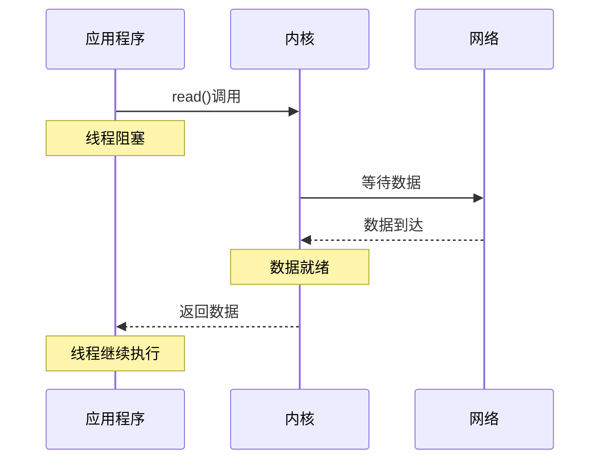
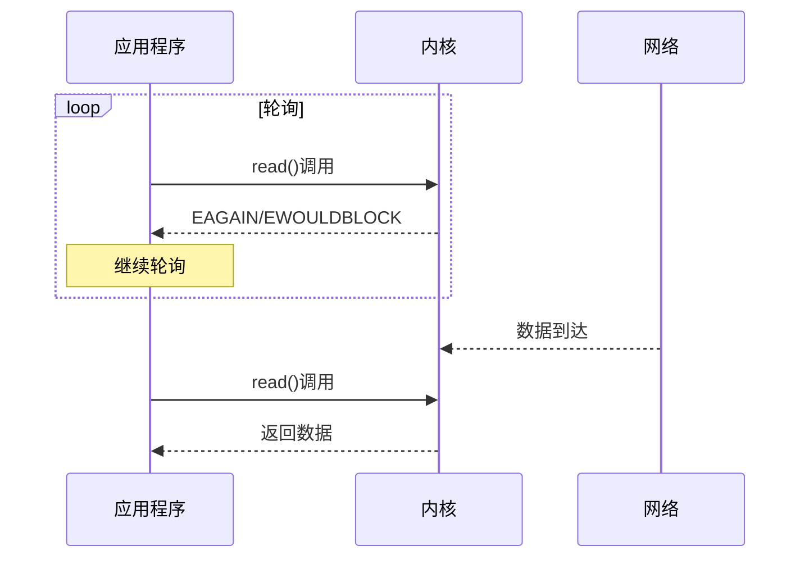
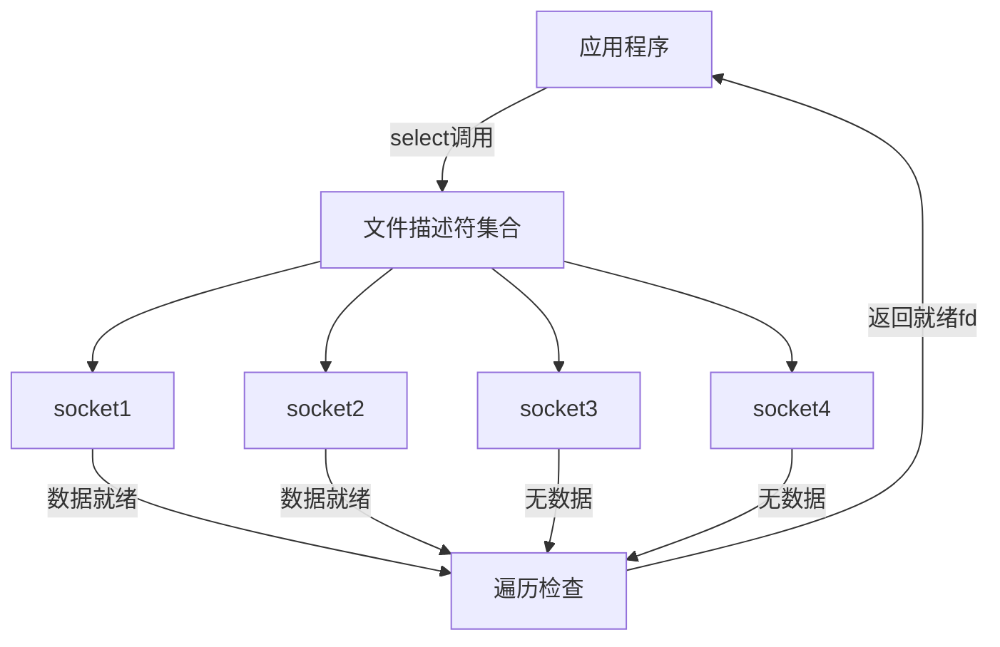
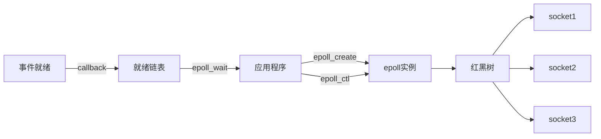

+++
title = 'WebSocket消息接收机制技术文档'
date = 2024-12-06T21:58:28+08:00
draft = true
+++

## 1. 概述

本文档详细介绍了在网络编程中常用的几种消息接收机制，从最基础的阻塞式IO到现代的异步IO方案，并配合示例代码和图解说明工作原理。

## 2. 基础机制

### 2.1 阻塞式IO（Blocking IO）

#### 工作流程图



#### 示例代码

```cpp
// 阻塞式接收示例
class BlockingReceiver {
public:
    void receive() {
        char buffer[1024];
        while (true) {
            // 线程会阻塞在这里直到数据到达
            int n = read(socket_fd_, buffer, sizeof(buffer));
            if (n > 0) {
                process_data(buffer, n);
            }
        }
    }
private:
    int socket_fd_;
};
```

### 2.2 非阻塞式IO（Non-blocking IO）

#### 工作流程图



#### 示例代码

```cpp
class NonBlockingReceiver {
public:
    void receive() {
        char buffer[1024];
        // 设置非阻塞模式
        fcntl(socket_fd_, F_SETFL, O_NONBLOCK);
        
        while (true) {
            int n = read(socket_fd_, buffer, sizeof(buffer));
            if (n < 0) {
                if (errno == EAGAIN || errno == EWOULDBLOCK) {
                    // 暂无数据，继续轮询
                    continue;
                }
            } else if (n > 0) {
                process_data(buffer, n);
            }
        }
    }
private:
    int socket_fd_;
};
```

## 3. 高级机制

### 3.1 IO多路复用

#### 3.1.1 select/poll机制图解



#### select示例代码

```cpp
class SelectReceiver {
public:
    void receive() {
        fd_set readfds;
        while (true) {
            FD_ZERO(&readfds);
            // 将所有socket加入集合
            for (auto fd : socket_fds_) {
                FD_SET(fd, &readfds);
            }
            
            int max_fd = *std::max_element(socket_fds_.begin(), socket_fds_.end());
            int ready = select(max_fd + 1, &readfds, NULL, NULL, NULL);
            
            if (ready > 0) {
                for (auto fd : socket_fds_) {
                    if (FD_ISSET(fd, &readfds)) {
                        handle_ready_socket(fd);
                    }
                }
            }
        }
    }
private:
    std::vector<int> socket_fds_;
};
```

### 3.2 epoll架构图



#### epoll示例代码

```cpp
class EpollReceiver {
public:
    void init() {
        epoll_fd_ = epoll_create1(0);
        for (auto fd : socket_fds_) {
            struct epoll_event ev;
            ev.events = EPOLLIN | EPOLLET;  // 边缘触发
            ev.data.fd = fd;
            epoll_ctl(epoll_fd_, EPOLL_CTL_ADD, fd, &ev);
        }
    }
    
    void receive() {
        struct epoll_event events[MAX_EVENTS];
        while (true) {
            int n = epoll_wait(epoll_fd_, events, MAX_EVENTS, -1);
            for (int i = 0; i < n; i++) {
                if (events[i].events & EPOLLIN) {
                    handle_ready_socket(events[i].data.fd);
                }
            }
        }
    }
private:
    int epoll_fd_;
    std::vector<int> socket_fds_;
};
```

## 4. 性能对比

### 4.1 不同机制的性能特征

| 机制 | 延迟 | CPU占用 | 并发处理能力 | 实现复杂度 |
|------|------|---------|--------------|------------|
| 阻塞IO | 高 | 低 | 低 | 简单 |
| 非阻塞IO | 中高 | 高 | 中 | 中等 |
| select/poll | 中 | 中 | 中 | 中等 |
| epoll | 低 | 低 | 高 | 复杂 |
| io_uring | 极低 | 极低 | 极高 | 非常复杂 |

### 4.2 适用场景对比

| 机制 | 适用场景 | 典型连接数 | 主要优势 |
|------|----------|------------|----------|
| 阻塞IO | 简单应用 | <100 | 实现简单 |
| 非阻塞IO | 小规模应用 | <1000 | 响应及时 |
| select/poll | 中等规模 | <1000 | 跨平台 |
| epoll | 大规模服务器 | >10000 | 高性能 |
| io_uring | 高性能服务器 | >10000 | 极致性能 |

## 5. 最佳实践

### 5.1 选型建议

1. 对于简单应用
   - 使用阻塞IO
   - 场景：内部工具、测试程序

2. 对于一般服务
   - 使用epoll
   - 场景：Web服务器、代理服务器

3. 对于高性能要求
   - 使用io_uring
   - 场景：高频交易、游戏服务器

### 5.2 性能优化要点

1. 系统配置
   ```bash
   # 调整系统参数
   sysctl -w net.core.rmem_max=16777216
   sysctl -w net.core.wmem_max=16777216
   ```

2. 程序优化
   ```cpp
   // CPU亲和性设置
   cpu_set_t cpuset;
   CPU_ZERO(&cpuset);
   CPU_SET(target_cpu_, &cpuset);
   pthread_setaffinity_np(pthread_self(), sizeof(cpuset), &cpuset);
   ```

## 6. 总结

通过合理选择消息接收机制，可以显著提升系统性能：

1. 根据实际需求选择合适的机制
2. 注重系统调优和性能优化
3. 权衡开发成本和维护成本

关键考虑因素：
- 系统规模
- 性能要求
- 开发维护成本
- 团队技术储备